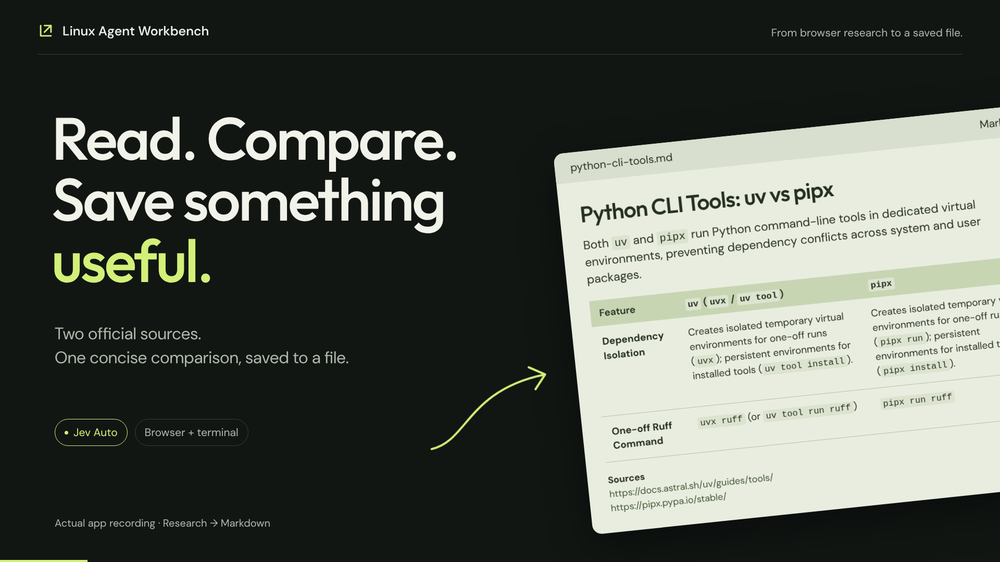
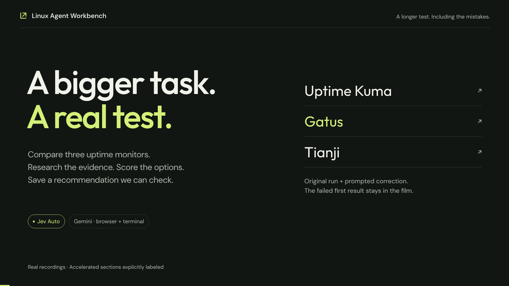
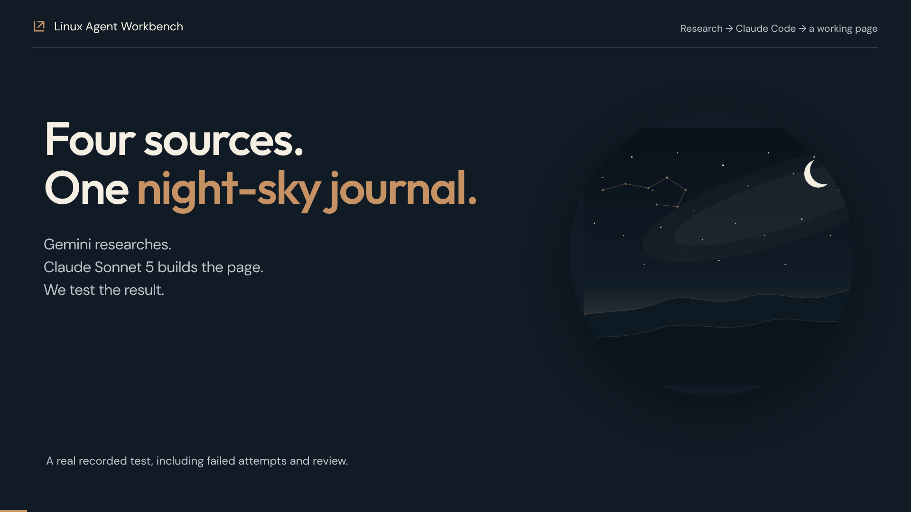
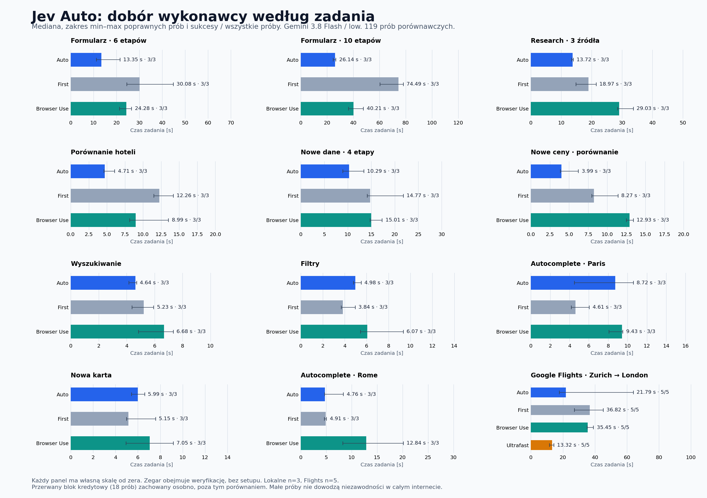

# Linux Agent Workbench

A Linux desktop workspace where an AI agent operates a containerized terminal and browser while you watch, review approvals, and take control.

**One application, several ways to execute browser work.** Jev Auto lets the primary planner choose fast Jev subgoals, grouped form actions or reading and reasoning per subtask. It uses the same conversation, browser session, permission checks and Stop control. Classic remains the default; Auto is explicitly experimental.

Codex subscription sign-in is the default provider. OpenRouter and the OpenAI Responses API are explicit, separately billed alternatives. The Auto benchmarks below use Gemini through OpenRouter plus Jev. Provider keys are configured privately on the host; a unified Settings setup remains on the roadmap.

**MIT-licensed, Linux source release.** No installer or clean-machine compatibility guarantee is claimed. The owner-run [clean installation check](docs/CLEAN-INSTALL-CHECK.md) is pending. Read the [security model](SECURITY.md) before connecting accounts or opening a workspace containing sensitive data. This project is not affiliated with OpenAI, Google, Browser Use or TypeSafe.

## Watch it work

Three real desktop tasks, from a short research note to a page built with Claude Code. The longer tests include failures and prompted corrections; these films are demonstrations, not additional matched benchmarks.

| Research → a saved file | Compare monitoring tools | Research → a landing page |
| --- | --- | --- |
| [](https://github.com/bartek-filipiuk/linux-agent-workbench/releases/download/demo-videos-2026-09-18/linux-agent-research-to-file.mp4) | [](https://github.com/bartek-filipiuk/linux-agent-workbench/releases/download/demo-videos-2026-09-18/linux-agent-long-test.mp4) | [](https://github.com/bartek-filipiuk/linux-agent-workbench/releases/download/demo-videos-2026-09-18/linux-agent-research-to-landing.mp4) |
| **40 s film.** Read uv/pipx docs and save a sourced Markdown comparison. **9.203 s task; $0.0371.** | **3:08 film.** Research three products, score them and check a report. **179 s + 93 s prompted correction; $1.1433.** | **1:57 film.** Gemini researches; **Claude Sonnet 5** builds HTML. **12:33 including review and recovery; $1.2757 OpenRouter + $1.5598 Claude API-equivalent estimate.** |

Click a thumbnail to watch or download the MP4. Claude used a Max subscription; its estimate is not a confirmed extra charge. [Film descriptions, subtitles and bonus release-lookup demo](docs/demos/README.md) · [Full tasks, outcomes and costs](docs/research/VIDEO-TESTS.md)

## Measured browser performance

**119/119 tasks completed in the latest selected comparison.** On a ten-stage form, Auto took **64.9% less time than Jev First** and **35.0% less than Browser Use**. Auto combines short delegated subgoals with guarded action batches. These are whole-configuration comparisons, not an isolated test of batching.

Successful task-time medians, in seconds; September 18, 2026:

| Task | Jev Auto | Jev First | Browser Use | Native Ultrafast |
| --- | ---: | ---: | ---: | ---: |
| Ten-stage form | **26.14** | 74.49 | 40.21 | — |
| Compare hotel offers | **4.71** | 12.26 | 8.99 | — |
| Research three hosting offers | **13.72** | 18.97 | 29.03 | — |
| Apply catalog filters | 4.98 | **3.84** | 6.07 | — |
| Google Flights: Zurich → London | 21.79 | 36.82 | 35.45 | **13.32** |

Same Gemini model/upstream, sequential rotating engine order, independent final verification. Local cells have **3 attempts**; Flights has **5**. Time includes recovery and verification, excludes setup. Auto does not win every task: First was faster on some simple interactions, and native Ultrafast remained fastest on Flights. Auto's Flights range was **17.83–64.02 s**. Most tasks are synthetic, and these small samples do not prove general web reliability. Browser Use here means its pinned open-source agent with Gemini, not its hosted models or cloud.

[](docs/benchmarks/jev-auto/comparison.svg)

We publish the unsuccessful runs too: **606 retained historical runner records**, **78 routing checks**, **8 direct-driver checks**, and **24 desktop checks**, plus source hashes and traces. The credit-interrupted block remains separate from the declared 119-record comparison. Known retained experiment cost was about **$11.05**, excluding subscription allocation, missing usage and development work.

[All results](docs/research/ALL-RESULTS.md) · [Methodology](docs/research/TEST-CATALOG.md) · [CSV](docs/research/trials.csv) · [Costs](docs/research/COSTS.md) · [Reproduce the benchmarks](docs/BENCHMARKS.md)

## How Auto chooses execution

**Gemini plans; Jev handles delegated browser interactions.** Gemini is the primary planner in our tested configuration. It understands the request, chooses the next tool, compares results and checks whether the goal has been met. Auto makes this choice throughout the task, so different steps can use different methods. Other configured primary models fill the same planner role.

- **Mechanical UI work:** the planner delegates a short outcome and known text values to Jev.
- **Several known form fields:** the planner groups up to eight actions, with freshness and permission checks on every action.
- **Research, comparisons and calculations:** the primary model reads and reasons, then executes a concrete result.

For example, Gemini can turn “find a Zurich–London flight” into a concrete search goal, delegate the search controls to Jev, then read and compare the returned flights itself. Jev chooses the browser actions needed for that subgoal; the app validates and executes them. Grouping actions or delegating several interactions can save time by reducing how often Gemini needs to plan an individual click.

Tool selection is part of the normal planner response; there is no extra classifier request. Jev chooses actions within a subgoal, not the application's overall architecture. Lack of progress or uncertainty returns control to the planner with fresh evidence; uncertain mutations are not blindly replayed. Native Browser Use and Ultrafast are research references, not extra app runtimes.

[Architecture and setup](docs/APPLICATION.md) · [Security boundaries](SECURITY.md) · [Release status](docs/RELEASE-READINESS.md)

## What works today

- A real terminal with PTY/tmux, interactive applications, and a persistent workspace.
- A separate Chromium browser with tabs, screenshots, DOM observations, downloads, and manual sign-in.
- Browser research: read rendered page content and save source captures as Markdown for terminal or coding-agent work.
- Codex subscription authentication, account-specific model choices, and reasoning effort selection.
- Human takeover, approval cards, activity history, output inspection, and tracked-file restoration for Git workspaces.
- Durable current conversations with follow-ups, pause/interrupt controls and continuation after app restart. Independent browser restart preserves the saved profile and workspace.
- A growing task editor, saved preferences, explained working styles, and separate step/time limits.
- Pausing at a limit and continuing the same live task, with explicit Stop throughout.

## Requirements

Use a Linux desktop with:

- Node.js **24** (`.nvmrc`) and pnpm **10.24.0** (`packageManager`).
- Rootless Podman configured for your user; `podman info` must work without sudo.
- Git, a C/C++ toolchain, Python 3, and Linux libraries needed by Electron and `node-pty`.
- [Codex CLI](https://learn.chatgpt.com/docs/cli) installed on the host for the subscription provider. Follow its official installation instructions. The integration was tested with **0.153.4**; model availability depends on the account.
- Space for both container images. The build script requires at least **5 GB free** on the workspace and Podman-storage filesystems and checks a **14 GB allocated-storage ceiling** afterward. Shared image layers are counted once; profiles and orphaned storage also count.

Development has been exercised on Ubuntu with rootless Podman. Other Linux distributions may need different packages. There are no Windows/macOS support or packaged-release claims.

## Run from source

Clone this repository and run the commands below. They assume nvm is installed; if you installed Node 24 another way, skip the two nvm commands and ensure that version is on PATH:

```bash
git clone https://github.com/bartek-filipiuk/linux-agent-workbench.git
cd linux-agent-workbench
nvm install
nvm use
npm install --global pnpm@10.24.0
pnpm install --frozen-lockfile
cp .env.example .env

# Build both isolated environments; the generated image IDs are local to your machine.
pnpm images:build
pnpm images:build:browser

pnpm dev
```

The image build scripts also prune unused older LAW images/build cache after a successful build. Review [maintenance](docs/USER_GUIDE.md#maintenance-and-diagnostics) before running them on a host with other Podman projects.

In the app:

1. Expand the setup/account panel and choose **Sign in to Codex**. Finish authentication yourself in the system browser.
2. Choose **Open workspace…** and select a dedicated project directory. The agent can change files there.
3. Choose **Browser** or **Both**, then **Open browser** if your task needs it.
4. Under **New task**, enter a goal, review **Working style**, limits, and **Model & reasoning**, then choose **Start task**.

A first task that needs no website account:

> Inspect the current terminal directory without changing anything. Report the working directory and the names of the files you can see.

For terminal-based authentication and an optional subscription-consuming connection test:

```bash
pnpm codex:login
pnpm codex:status
pnpm codex:smoke
# Remote login, if supported by your account:
pnpm codex:login --device-auth
```

The app uses a dedicated Codex home, separate from your usual coding-agent login. There is **no automatic paid API fallback**. Subscription sign-in and API-key billing are different authentication paths; quota and access depend on your account. [Official OpenAI authentication documentation](https://learn.chatgpt.com/docs/auth).

## Documentation

| Document | What it covers |
| --- | --- |
| [Video demonstrations](docs/demos/README.md) | Recorded tasks, failures, corrections, subtitles and output files |
| [Current application](docs/APPLICATION.md) | Shared runtime, browser modes, Auto routing, recovery, security boundaries and Gemini/Jev setup |
| [Research and publication kit](docs/research/README.md) | All retained experiments, methodology, per-trial CSV, costs and shareable charts |
| [Release readiness](docs/RELEASE-READINESS.md) | One-app integration, license, clean installation and reproducible benchmark work |
| [Benchmark guide](docs/BENCHMARKS.md) | Pinned reference setup, portable paths, date verification and explicit paid runs |
| [Clean installation checklist](docs/CLEAN-INSTALL-CHECK.md) | Owner-run validation on a fresh Linux user/machine; currently pending |
| [User guide](docs/USER_GUIDE.md) | Installation details, daily workflow, browser login, approvals, limits, history, troubleshooting |
| [Configuration](docs/CONFIGURATION.md) | Current Settings controls, environment variables, providers, credentials and local data |
| [Codex integration](docs/codex-integration.md) | Dedicated sign-in, App Server, model/effort selection and tool boundary |
| [Architecture](linux-agent-workbench-architecture.md) | Processes, tools, policies, network and storage |
| [Security](SECURITY.md) | Trust model, known limitations, disclosure and safer operation |
| [Security review](docs/security-review.md) | Review scope, findings, fixes and verification limits |
| [Roadmap](ROADMAP.md) | Planned multi-provider subscription/API setup and later priorities |
| [Contributing](CONTRIBUTING.md) | Development checks and publication prerequisites |

## OpenAI API alternative

Use a private app configuration file outside the workspace, or the ignored repository `.env` for development:

```dotenv
LAW_PROVIDER=openai
OPENAI_API_KEY=your-api-key
OPENAI_MODEL=gpt-5.6-sol
```

Restart the app after changing provider configuration. API usage is billed separately from ChatGPT. An available OS keyring encrypts the saved API key; otherwise it stays in the configuration file with a visible warning. Never open a directory containing that file as the agent workspace. See [configuration and key precedence](docs/CONFIGURATION.md).

## Development checks

```bash
pnpm typecheck
pnpm test
pnpm build
```

Worker browser tests need a local Playwright Chromium installation; see [Contributing](CONTRIBUTING.md). Real container tests are opt-in with `pnpm test:container` after building both images. Tests normally use fake providers and do not spend model quota.

## License

[MIT](LICENSE), copyright 2026 Bartek Filipiuk and contributors. Dependencies and upstream research projects retain their own licenses; see [third-party notices](THIRD_PARTY_NOTICES.md).
