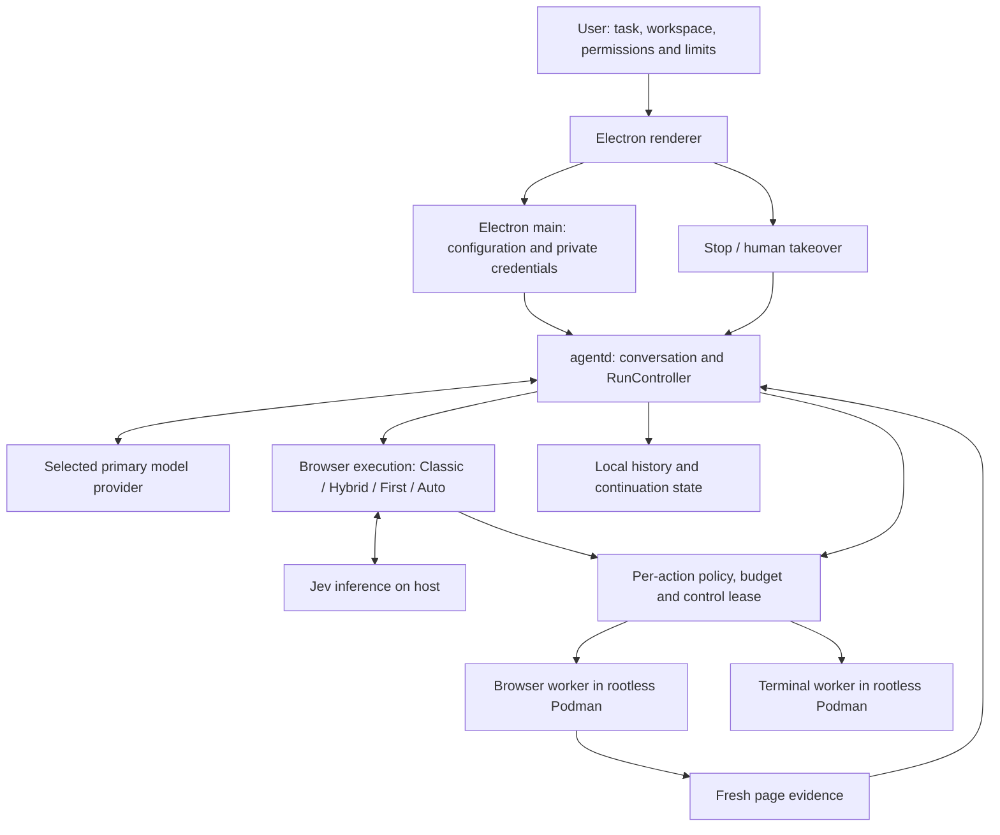

# Linux Agent Workbench: current application

The consolidated source release includes the Jev Auto implementation. Its published benchmark used application logic frozen at `0ea227b` and completed evidence at `55f53e5` (September 18, 2026); later portability and documentation checks are recorded separately. This is one Linux desktop application with a terminal, a browser, a shared conversation, approval controls, history and human takeover. Auto changes how browser work is executed within that application. It does not launch a second application for each task.

## Components and data flow



The renderer presents tasks and controls; it does not receive API keys. Electron main loads configuration and starts the daemon. `RunController` manages model turns and delegates tool requests through the existing policies and workers. Rootless Podman isolates browser and terminal workloads with restricted mounts and network egress. The selected workspace remains writable host data. Browser pages and terminal output are untrusted inputs.

The primary provider can be Codex subscription access, the OpenAI Responses API, or OpenRouter. Provider configuration is currently host-side; it is not yet a unified Settings connection wizard. In the tested Auto configuration, Gemini through OpenRouter is the planner, and Jev through TypeSafe is the fast browser decision model. Provider/model selection and browser execution mode are separate choices. No automatic switch to a more expensive model or from subscription to paid API is implemented.

## Browser modes in the same app

| Mode | How work proceeds | Intended use / current status |
| --- | --- | --- |
| Classic | Primary model requests the normal observe/read/action tools | Default in a new installation; compatible path without a Jev key |
| Jev Hybrid | Primary model can optionally delegate a short `browser_task` to Jev | Earlier experimental comparison mode |
| Jev First | Browser outcomes are delegated through Jev first; exceptions use controlled fallback | Explicit fast delegation; earlier comparison mode |
| Jev Auto | Primary model chooses Jev subgoals, guarded batches or reading/reasoning per subtask | Recommended experimental configuration for the measured mixed workload |
| Native Browser Use / Jev Ultrafast | Separate research runners | Not selectable app engines and not shipped execution dependencies |

The same task can use both fast and planned execution. Selecting Auto is not a prediction that one engine is best for the entire request. The benchmark's best result per task is not a lookup table embedded in the app.

## How Auto selects a method

The **primary planner** chooses its next tool using the task, previous results, available tools and Auto instructions. In our measurements that planner is Gemini. Jev chooses actions within a delegated mechanical subgoal; it does not decide which overall architecture or model to use.

The responsibilities are:

- **Gemini (or another configured primary model):** understand the request, plan the work, choose a tool for the next step, read and compare information, and assess completion against the user's requirements.
- **Jev:** use the current page observation to choose clicks, typing and other browser actions for a concrete delegated subgoal. The planner supplies known text values and handles broader reasoning.
- **The application:** `RunController` in the host-side `agentd` service processes the planner's tool calls. It runs the Jev loop or the planner's action batch, enforces policy and control checks, and sends permitted actions to the browser worker. Results return to the planner for its next decision.

For example, Gemini can resolve the route and date for a Zurich–London flight search, ask Jev to set the search controls and show results, then read and compare those results itself. For a form with several known fields, Gemini can instead plan a guarded batch; a batch may also contain just one action when the next step depends on its result. The choice is made during the task, not once for the entire request.

The potential speed gain comes from fewer primary-model planning turns: Jev can handle several interactions within one delegated subgoal, and one Gemini response can plan several independent form edits. Extra planning or recovery can offset that gain on simple tasks, as the benchmark counterexamples show.

| Situation | Planner instruction / tool | Example |
| --- | --- | --- |
| Mechanical navigation, search, filters, autocomplete | Start with `browser_task`; include outcome, optional URL and exact known non-secret text values | Search for a specified product and leave results visible |
| Multi-stage form or several known fields | Start planned; `browser_batch` with empty actions observes, then batches up to 8 actions | Fill the current segment's city, traveler and transport, then Next |
| Reading, comparisons, arithmetic, cross-page memory | Planner reads sources, reasons, then uses a batch or short mechanical subgoal | Compare all eligible hotels including mandatory charges |
| No progress, uncertain target/operation or unsupported interaction | Inspect fresh evidence and change the plan | Return from Jev to planned execution after a cycle |
| Sensitive/login action or missing authority | Existing permission/human takeover path | User enters credentials manually |

These are prompt-guided decisions, not a deterministic trained task classifier. The tool schema and action restrictions are enforced in code; perfect adherence to the preferred route is not. One final routing check chose a valid observation for a new-tab task instead of the expected fast path. This distinction is why we keep category tests, argument checks and end-to-end execution tests separate.

The first primary-model call already performs planning and tool selection; there is no separate classifier request. Its duration is not a pure measurement of routing overhead. Tools return fresh evidence, `completion_candidate` or `needs_help`, action counts and timing. The planner must compare evidence against the user's requirements before answering. Jev's `DONE` is not proof. Benchmark deterministic verifiers are additional test instrumentation, not an automatic universal production verifier.

## Execution and recovery

`browser_task` supplies the current structured page observation and possible choices to Jev. Text values come from the user's goal or the planner's resolved non-secret data; Jev is not asked to invent missing field text. The host validates responses, confidence and capability before an action reaches the browser worker. Auto's experimental minimum confidence is 0.35; First/Hybrid keep 0.55. The lower threshold alone did not improve the Flights pilot and does not establish correctness.

`browser_batch` holds at most eight actions planned from one observation. Independent field edits may precede a final transition; navigation/submit/click cannot be followed by actions based on guessed future references. Multi-action batches require stable DOM node identities, matching context and confirmation of earlier field edits. The current implementation groups ref/nodeId-based edits plus a final click; navigation, key press, wait and tab change use single-action batches. Uploads and coordinate actions are excluded.

Each child action still passes the original policy, approval, budget, Stop and human-control checks. Approval of one action does not authorize the remainder of a batch. Partial results report how many actions completed; the planner must not replay the whole batch after interruption. DOM replacement, changed controls/context or an unexpected field effect stop the batch for replanning.

Semantic progress fingerprints ignore changing refs/revisions so repeated states can be detected. Covered targets are rejected before dispatch. A known safe pre-dispatch rejection can trigger a fresh Jev decision at most twice consecutively. An action with an uncertain mutation result is not blindly retried. Human takeover, cancellation, limits and continuation preserve these boundaries.

`browser.route` records `fast` for `browser_task` and `planned` for batch/observe/read, along with previous mode and whether it switched. `browser.batch`, `browser.task`, provider timing and usage events explain execution. This is observability of tool choice; it does not move the session between multiple runtimes.

## Configure and run the measured setup

Follow [source installation requirements](../README.md#requirements): Linux desktop, Node 24, pnpm 10.24.0, rootless Podman and native build dependencies. From this branch, install with `pnpm install --frozen-lockfile`. The following creates the dedicated experimental profile; it is an optional instance of the same application.

Create `~/.config/linux-agent-workbench-jev-auto/.env` outside any agent workspace, with directory mode 0700 and file mode 0600:

```dotenv
LAW_PROVIDER=openrouter
OPENROUTER_MODEL=google/gemini-3.8-flash
OPENROUTER_EFFORT=low
OPENROUTER_PROVIDER=google-ai-studio
OPENROUTER_API_KEY=YOUR_OPENROUTER_KEY
TYPESAFE_API_KEY=YOUR_TYPESAFE_KEY
TYPESAFE_MODEL=jev-1.13.0
TYPESAFE_PRICE_INPUT_PER_MTOK=0.042
```

Use your own credentials and verify that your provider offers the configured model. The model ID and estimated Jev price reproduce the historical setup; they are not a current catalog or pricing guarantee. The app moves supported keys into OS-backed encrypted storage when available. Without a strong keyring backend the private environment file is the fallback. Never place real credentials in an issue, committed file or the selected workspace.

Build both worker images for this instance, then start it:

```bash
LAW_INSTANCE=jev-auto pnpm images:build
pnpm images:build:auto
pnpm dev:auto
```

In the app select a dedicated workspace, open the browser, choose **Jev Auto · experimental**, then review working style and limits before starting. Without a configured Jev key, the app rejects Jev modes; choose Classic or configure the key. A fresh profile still defaults to Classic. Changing provider requires restart/new-task handling; existing conversations retain provider context. Image IDs are local outputs and must be rebuilt on another machine.

For a single standard profile, use `pnpm images:build`, `pnpm images:build:browser`, `pnpm dev`, and configure `~/.config/@law/desktop/.env`. There is no need to install multiple applications. `dev:jev` and `dev:auto` are convenience scripts setting `LAW_INSTANCE`; they keep experimental settings/history/containers/profile volumes separate. The app's configuration location respects its Electron user-data environment; the examples above use standard Linux paths.

## Security, data and cost boundaries

Provider requests leave the host and may contain task text, page contents, screenshots or tool output. Local execution does not mean offline inference. Credentials remain in trusted host processes; they are not passed to the renderer/browser environment. Provider retention is external to the app. History and continuation text are stored locally without field-level encryption; screenshots are excluded from persisted continuation checkpoints. Browser cookies live in a persistent profile volume. Profiles are separated by instance, not automatically by workspace.

The browser/terminal workers use rootless containers and an egress proxy, but share the host kernel. The workspace is writable, external website actions cannot be undone by Git snapshots, and an open public-network policy is not an exfiltration guarantee. The interactive shell gate does not mediate every descendant process. Previously detached terminal processes may outlive Stop. Optional remote approvals and default permission modes have additional limits in [SECURITY.md](../SECURITY.md).

OpenRouter returned usage and Jev token-price estimates feed tracked spending. Limits are checked between calls and may overshoot during a request. Missing usage after interruption and unknown subscription costs are not zero. The UI's estimated spending limit is not a provider-side billing cap. OpenRouter retries model inference with bounded timeout/backoff; Jev retries only selected overload responses under one deadline. Neither retry policy grants authority to replay browser mutations.

## Code and documentation map

| Responsibility | Source |
| --- | --- |
| Auto instructions, batch schema, freshness and progress fingerprint | [browser-auto.ts](../services/agentd/src/orchestrator/browser-auto.ts) |
| Fast Jev loop, evidence and fallback | [jev-browser.ts](../services/agentd/src/orchestrator/jev-browser.ts) |
| Tool selection, per-action execution and route events | [run-controller.ts](../services/agentd/src/orchestrator/run-controller.ts) |
| Mode configuration and daemon validation | [ipc.ts](../services/agentd/src/ipc.ts) |
| Provider requests and usage | [openrouter.ts](../services/agentd/src/provider/openrouter.ts), [jev.ts](../services/agentd/src/provider/jev.ts) |
| Browser observations, node identities and action checks | [browser-session.ts](../services/browser-worker/src/browser-session.ts) |
| UI engine choice | [TaskComposer.tsx](../apps/desktop/src/renderer/TaskComposer.tsx) |
| Existing full process/network/storage architecture | [Architecture](../linux-agent-workbench-architecture.md) |
| User workflow / full configuration | [User guide](USER_GUIDE.md), [Configuration](CONFIGURATION.md), [OpenRouter](openrouter.md) |
| Evidence and next release | [Research kit](research/README.md), [release readiness](RELEASE-READINESS.md) |

Auto is implemented and locally validated, but remains experimental. Portable benchmark setup is available in [BENCHMARKS.md](BENCHMARKS.md). Broader live-site reliability, provider onboarding and binary packaging have distinct remaining work; the [release checklist](RELEASE-READINESS.md) separates these from missing core execution features.
