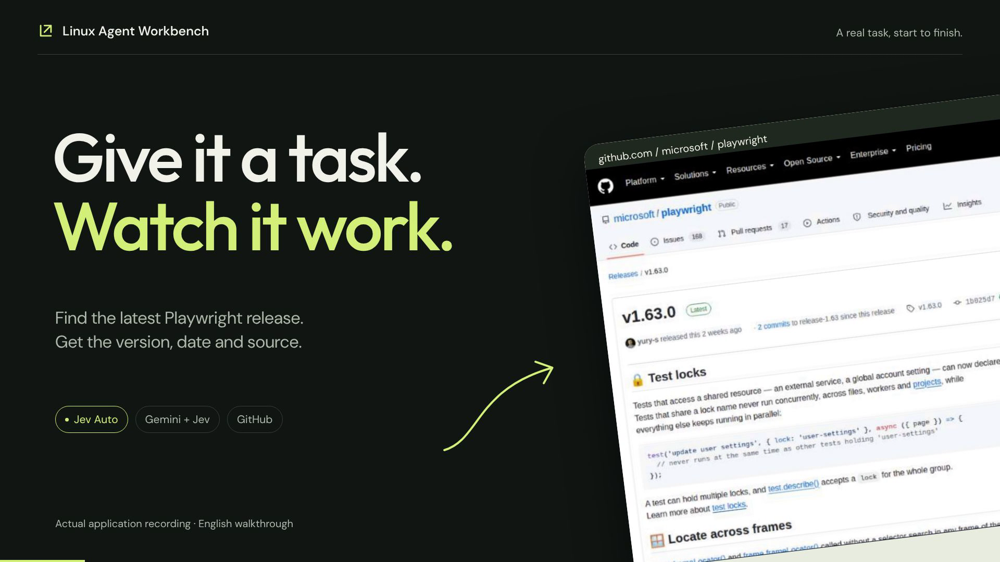

# Find the latest Playwright release

**A browser-only lookup with a visible Jev-to-planner handoff.** The selected take returned a verified release and left its page open.

Recorded on September 18, 2026, using app source `293696d`. Gemini `google/gemini-3.8-flash` with low reasoning planned through OpenRouter / Google AI Studio; browser mode was Jev Auto (`jev-1.13.0`). The run used an isolated app profile and workspace. These are individual demonstrations, not matched speed benchmarks. No application runtime code was changed for the recording.

## Exact prompts and what happened

**Original task:**

> Open the Playwright repository on GitHub. Find the latest stable release and report its version, release date, and source link. Use only the browser.

**Revised task used in the film:**

> Open https://github.com/microsoft/playwright/releases. Find the latest stable release, report its version, release date and source link. Leave its release page visible. Use only the browser.

The first take returned an answer but ended on GitHub API JSON. That was an editorial presentation problem; the first prompt did not require leaving the release page visible. The second take supplied a starting URL and added that requirement. The two timings therefore cannot establish a same-prompt speedup.

In the selected take, Gemini delegated a browser subtask to Jev, which reported no progress. Gemini continued using planned browser tools. The real handoff remains in the film. The result was Playwright v1.63.0, published September 4, 2026; an independent GitHub release API request confirmed it and the release page was visibly open.

What worked: usable recovery from Jev's no-progress report, correct final release evidence, requested browser end state. What changed: the task prompt and editorial take selection. **No routing code was fixed.** There were two takes, not one uninterrupted attempt.

Evidence: [selected run](../research/video-tests/01-release/evidence/run.json), [first take](../research/video-tests/01-release/evidence/take-1/run.json), [independent GitHub check](../research/video-tests/01-release/evidence/github-verification.json), [routing events](../research/video-tests/01-release/evidence/route-events.json), [production notes](../research/video-tests/01-release/PRODUCTION.md).

## Time, cost and outcome

| Attempt | Task time | Primary turns | Tool calls | Jev decisions | Known cost |
| --- | ---: | ---: | ---: | ---: | ---: |
| Original prompt | 31.125 s | 7 | 21 | 1 | $0.061865694 |
| Revised prompt, selected film | 15.677 s | 6 | 15 | 2 | $0.032173242 |
| Both takes | 46.802 s | 13 | 36 | 3 | $0.094038936 |

The event-based task clock runs from Start to app completion and excludes setup and review. The original prompt did not request a visible release page, so its JSON end state was a presentation issue rather than a failed explicit requirement. Changing the prompt means the two takes do not establish a speed improvement. The selected task recording is continuous at normal speed.

## Watch the film

[Watch / download MP4](https://github.com/bartek-filipiuk/linux-agent-workbench/releases/download/demo-videos-2026-09-18/linux-agent-first-tutorial.mp4) · [English subtitles](https://github.com/bartek-filipiuk/linux-agent-workbench/releases/download/demo-videos-2026-09-18/release-lookup.srt)

Film length: **41 s**. Film duration is different from measured task time. Provider costs exclude setup, infrastructure, this supervising conversation and video production; they are recorded usage or explicitly labeled estimates, not invoices.

[All demonstrations](README.md) · [Full test ledger](../research/VIDEO-TESTS.md) · [Application README](../../README.md#watch-it-work)
