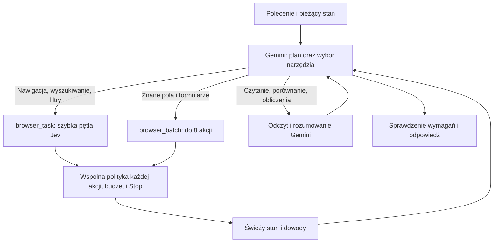

# Jev Auto: wykonawca wybierany według podzadania

Eksperymentalny tryb istniejącej aplikacji. Gemini wybiera między szybką pętlą Jev a krótkim planem akcji. Interfejs, rozmowa, przeglądarka i uprawnienia pozostają wspólne. Nie wbudowujemy Browser Use jako kolejnego runtime’u: jego zysk trzeba porównać z prostszym batchowaniem, które zachowuje aktualną kontrolę akcji.

## Uruchomienie

```bash
cd /home/bartek/linux-agent-auto
pnpm dev:auto
```

Wybierz **Jev Auto · experimental** w istniejącym polu **Browser engine**. Provider i model są wybierane jak dotychczas; pomiary wykonano na Gemini `google/gemini-3.8-flash / low` przez OpenRouter (`google-ai-studio`) oraz `jev-1.13.0`. Nie ma osobnego zapytania klasyfikacyjnego ani automatycznej zmiany na droższy model. Classic pozostaje domyślnym trybem świeżej instalacji; izolowany profil testowy ustawiono na Auto.

Kod: worktree `/home/bartek/linux-agent-auto`, branch `experiment/jev-auto`. Main i baseline `/home/bartek/linux-agent-jev` pozostają nietknięte. Osobny profil `LAW_INSTANCE=jev-auto` rozdziela ustawienia, historię i kontenery. W tym środowisku profil jest gotowy i korzysta z kluczy zaszyfrowanych przez OS. Testowy workspace: `experiments/browser-auto/artifacts/ui-workspace`.

Na nowej maszynie: Node 24+, pnpm zgodny z `packageManager`, Podman i skonfigurowany dostęp do providerów; `pnpm install`, `pnpm build`, następnie `pnpm images:build:auto`. Runner badawczy ma jawne ścieżki do lokalnego baseline i PoC; wymaga również środowiska Python/vendorów tego PoC. Nie jest przenośnym instalatorem aplikacji.

## Jak działa wybór



Wybór następuje dla podzadania, więc ten sam przebieg może przejść z fast do planned. Jev nie wybiera architektury ani nie porównuje nierozstrzygniętych ofert. W dzienniku są `browser.route`, `browser.batch`, `browser.task`, czasy i koszty modeli. `switched` oznacza zmianę ścieżki, nie przełączenie procesu lub przeglądarki. Pierwsza odpowiedź Gemini obejmuje planowanie i routing; jej całego czasu nie można nazwać narzutem routera. Nie zmierzyliśmy czystego kosztu routingu przez osobną ablację.

## Granice wykonania

- Batch ma maksymalnie 8 akcji. Przejście strony, kliknięcie lub oczekiwanie musi kończyć sekwencję. Grupowanie wielu akcji w tej wersji obejmuje cele z ref/nodeId, typowo edycje pól i końcowe kliknięcie. Nawigację, press, wait i zmianę karty wykonuj osobno. Upload i działania po współrzędnych są poza batchem.
- Każda akcja przechodzi istniejącą politykę, budżet i kontrolę przejęcia przez człowieka. Zgrupowanie nie jest jedną zbiorczą zgodą.
- Wiele edycji wymaga identyczności węzłów DOM, zgodnego kontekstu i potwierdzonego efektu poprzedniej edycji. Aktualizowane są ref/revision, nie odgadywane selektory. Pojedyncza akcja zachowuje kontrole workera.
- Zasłonięty cel jest odrzucany przed dispatch. Jev może podjąć nową decyzję po takim bezpiecznym odrzuceniu, najwyżej dwa razy z rzędu. Nie odtwarza niepewnych mutacji.
- Cykl wykrywamy po semantycznym stanie strony niezależnie od zmian ref/revision. Po braku postępu planista dostaje `needs_help` i świeże dowody.
- Auto stosuje eksperymentalny próg confidence 0,35; First/Hybrid nadal 0,55. Confidence nie dowodzi poprawności, a obniżenie progu samo w sobie nie poprawiło pilota Flights. Polityka, kontrola celu i ocena wyniku pozostają wymagane.
- Klucze są po stronie hosta. Audyt sprawdza ich rzeczywiste wartości w plikach i konfiguracji uruchomionych procesów bez wypisywania sekretów. Testy nie stanowią pełnego audytu odporności na prompt injection ani wszystkich rodzajów witryn.

Wspólna poprawka OpenRouter jawnie oznacza obiektowe `oneOf`/`anyOf` jako `type: object`, zachowując ograniczenia schematu. Usuwa zaobserwowany problem, w którym Gemini przekazywał JSON jako tekst do Classic. W finalnym porównaniu **oba** warianty aplikacji mają ten sam adapter; kontroler, narzędzia i worker First pochodzą z zamrożonego baseline.

## Testy i odtwarzanie

```bash
pnpm test
pnpm typecheck
pnpm build
LAW_CONTAINER_TESTS=1 pnpm exec vitest run tests/container
LAW_INSTANCE=jev-auto LAW_DESKTOP_TEST_OUTPUT=/tmp/auto-desktop-new.json node tests/ui/auto-desktop.mjs
pnpm bench:auto --engines app-auto,app-first,browser-use --tasks local --runs 3 --output experiments/browser-auto/artifacts/new-local.json
pnpm bench:auto --engines app-auto,app-first,browser-use --tasks holdout --runs 3 --output experiments/browser-auto/artifacts/new-holdout.json
pnpm bench:auto --engines app-auto,app-first,ultrafast,browser-use --tasks google-flights --runs 5 --output experiments/browser-auto/artifacts/new-flights.json
```

Testy live zużywają API; runner nie nadpisuje plików wynikowych. Limit raportowanego kosztu domyślnie $15 uwzględnia poprzednie pliki JSON w folderze wynikowym. Każda próba ma limit $1 i 240 s. Usage przerwanego zapytania może nie wrócić do klienta. Zadania Flights są wyszukiwaniem, bez wyboru lub rezerwacji lotu.
