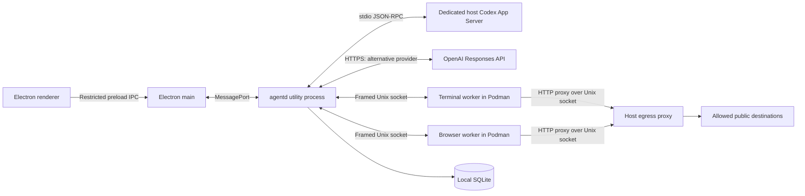

# Linux Agent Workbench architecture

This document describes the implemented application as of September 2026. It replaces the original planning specification, which mixed shipped behavior with future goals. Historical implementation plans remain under `docs/superpowers/`; they are design history, not the current user contract. Future work belongs in [ROADMAP.md](ROADMAP.md).

## Process and trust boundaries

The UI, orchestrator and worker environments are separate processes. The trusted host-side daemon invokes providers and executes validated tool requests through the worker protocol. The model does not receive the Electron IPC bridge or unrestricted host shell tools.

Codex with ChatGPT subscription sign-in is the default operator. The Responses API is explicitly selected and separately billed. No automatic fallback changes the account or billing path.

## Repository map

| Directory | Responsibility |
| --- | --- |
| `packages/protocol` | Zod schemas, errors, run/model/browser contracts, length-prefixed socket framing |
| `services/agentd` | Provider adapters, run loop, policies, approval state, session containers, egress and SQLite |
| `services/terminal-worker` | PTY/tmux lifecycle, terminal input/output, observations, shell-gate connection |
| `services/browser-worker` | Playwright Chromium, browser observations/actions, preview and manual-browser mode |
| `apps/desktop/src/main` | Window/IPC security, provider configuration, credentials, daemon lifecycle and diagnostics |
| `apps/desktop/src/preload` | Explicit renderer capabilities rather than raw Electron IPC access |
| `apps/desktop/src/renderer` | React workspace, task composer, model selection, approvals, history and previews |
| `images` | Worker Containerfiles, Bash gate and generated local image pins |
| `fixtures`, package `test` directories | Synthetic providers, websites and unit/integration tests |
| `tests/container` | Opt-in tests of actual Podman environments |
| `scripts` | Builds, owned-image cleanup, Codex authentication/smoke and benchmarks |

## Run lifecycle

The renderer submits a goal, working style, limits and optional model/effort. Main validates the selection and forwards it to `Daemon`. The daemon requires a ready sandbox, no conflicting active run/network change and no active manual login. It creates a Git snapshot when available, resolves profile behavior, constructs policies/executors and starts a `RunController`.

Each iteration:

1. Honor stop/human handoff and check applicable budgets.
2. Call the selected adapter with the goal or pending tool results.
3. Record usage, response text and tool-request metadata.
4. Validate/authorize tools, wait for approvals where needed, and execute through the relevant worker.
5. Return observations/results to the same provider conversation.
6. Complete when the provider returns a final answer without further tools.

Provider requests and worker actions support cancellation and timeouts. Errors cross boundaries as typed protocol errors. A lost worker fails the run rather than inviting unlimited blind retries.

### Context management

`CodexAppServerAdapter` manages its own persistent App Server thread during a live run. It translates LAW tool calls/results into dynamic tool requests/replies and handles text/images. The thread has a read-only host sandbox and a dedicated operator directory. Host shell, browser/computer, plugins and other built-in action capabilities are disabled; unexpected host requests are rejected. The Code Mode host remains enabled because the tested CLI needs it to deliver dynamic tools. Runtime capability drift remains an upgrade risk.

`OpenAIResponsesAdapter` uses `previous_response_id` and `store: true` with function tools and text/image results. It has bounded retries/backoff and a per-attempt deadline. The research and project profiles can compact their API response chain after 12 and 20 turns respectively; Codex manages its own compaction. These adapter differences do not change the policy/executor boundary.

### Pause, approval and continuation

States include `running`, `awaiting_approval`, `handoff` and `budget_paused`, followed by terminal outcomes such as `completed`, `stopped`, `failed` or `interrupted`. Legacy `budget_exceeded` remains readable in older history.

`budget_paused` retains the live controller, adapter and pending results without polling. The human owns both surfaces. Continuation checks run ID, state, reason-specific action and manual-login restrictions. Removing the step cap also removes the tool-call cap; time and cost are separate. Pre-pause actions are invalidated and the model is asked to observe again. Human waiting does not consume active-time allowance.

The main process retains a UI snapshot and sequence numbers so renderer reload can recover without replaying actions. A daemon/app restart marks unfinished runs interrupted. There is no durable reconstruction of a live provider thread.

## Terminal and shell policy

The terminal worker runs `node-pty` and reconnectable tmux inside `law-terminal-<session-id>`. The selected host workspace is mounted read/write at `/workspace`. Dedicated named volumes retain nested coding-agent and SSH state; the host `.gitconfig` can be mounted read-only.

The instrumented interactive Bash shell calls a small compiled gate over a local socket before commands. Agentd classifies commands and can request approval. A nested-prompt policy detects permission/password prompts before the agent sends more input. Surface leases distinguish human and agent control.

The gate is not syscall-level containment. Scripts, other shells, child processes and malicious socket users are outside complete mediation. Container/mount/network permissions are the remaining boundary. See [SECURITY.md](SECURITY.md).

## Browser

The browser worker runs separately in `law-browser-<session-id>` and has no workspace or host SSH mount. It owns a persistent profile volume and a per-session downloads directory. The default profile is shared across workspaces; profile isolation is future work.

Automated mode uses Playwright Chromium. Observations combine page metadata, DOM/ARIA-derived elements, frame traversal, revision-bound element references and optional screenshots. Actions validate refs/revisions and pass through browser policy. Popups, tabs, dialogs and downloads have explicit handling.

Manual login closes the automated context and starts full Chromium on a private Xvfb/Openbox display in the container. Image/input transport covers the full browser window without attaching Playwright/CDP to it. The daemon parks the operator before the transition and blocks resume until manual mode finishes. It retains the same profile afterward. Sanitizing a return URL can interrupt an OAuth flow switched mid-redirect; see [browser-login notes](docs/analysis/browser-auth-2026-09-09.md).

## Isolation and egress

Both worker containers use rootless Podman, dropped capabilities, no-new-privileges, read-only root filesystems, bounded writable tmpfs mounts, and memory/PID limits. CPU quotas are not currently applied. Container isolation shares the host kernel.

`--network none` means tools must use the HTTP proxy forwarder exposed inside each container. Its Unix socket connects to agentd. The host checks destination names, resolves them, rejects non-public addresses and connects to the exact checked address. Explicit checks cover IPv4-mapped/expanded IPv6 and local ranges; hostname prefix checks alone are insufficient. The optional domain gate controls new hosts during active runs.

The proxy is an egress restriction, not a data-loss-prevention system. It cannot make a public destination trustworthy. The provider connection runs on the host and is not disabled by sandbox `NET none`.

## State, secrets and retention

SQLite (`node:sqlite`, WAL) holds workspaces, runs, events, tool-call text/results, approvals, usage and egress records. Screenshots are omitted from the SQLite tool log. Text and URLs can still contain sensitive data. Startup prunes finished history older than 30 days and marks unfinished runs interrupted.

Codex uses a dedicated home outside the workspace; its runtime controls its authentication store. API keys are resolved in main and encrypted through strong `safeStorage` backends when available. A plaintext `.env` fallback remains possible and visible. The renderer receives account status/model metadata, not API keys.

Diagnostics run asynchronously with cancellation and redact common credential patterns. Redaction is not a confidentiality guarantee. See [configuration](docs/CONFIGURATION.md) for paths and [security](SECURITY.md) for credential/profile limitations.

## Performance controls

- Browser frames wait for renderer acknowledgement; obsolete frames are replaced/dropped instead of accumulating.
- Preview streaming pauses when the panel is hidden, expanded editing covers it, or the desktop window is not visible/focused. Explicit agent observations remain available.
- Terminal output has acknowledgements, backpressure and bounded buffers. A limit failure is explicit rather than silently discarding screen bytes.
- The activity UI bounds its recent rows and memoizes existing entries; reading older rows does not force-scroll the user.
- Task drafts/preferences use debounced writes and flush on lifecycle boundaries.
- Budget and approval pauses wait on events rather than repeatedly calling the model.

Not every input queue is fully resource-budgeted; proxy/provider stress limits remain roadmap work.

## Extension contracts

A provider adapter produces text, usage and LAW tool requests through `ModelAdapter`; it must not execute host actions. New integrations need explicit authentication, capability discovery, cancellation and billing semantics. A subscription alone is not an API contract.

A new model tool requires a schema/spec, executor, suitable policy, user-visible preview and tests. Worker changes require rebuilding the corresponding image. UI restrictions with security consequences must also exist in the daemon or main process.

Historical plans may mention unimplemented MCP/ACP, additional platforms or durable replay. Those are not supported interfaces today. [ROADMAP.md](ROADMAP.md) is the current future-work reference.
